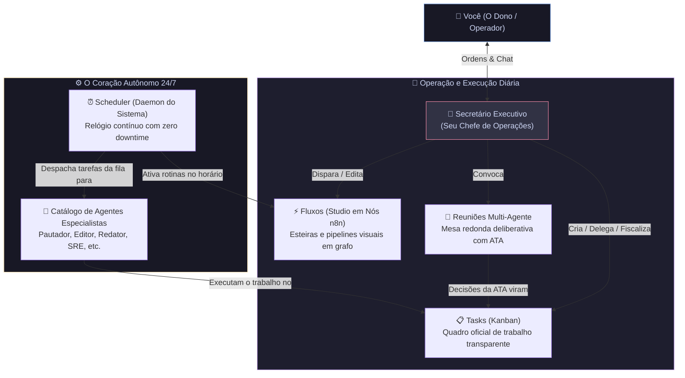

<div align="center">
  
  <h1>OpenCorp</h1>
  <p><strong>Sistema Operacional de Empresas Autônomas Movidas por Agentes de IA</strong></p>

  <p>
    <a href="LICENSE"></a>
    <a href="https://nodejs.org"></a>
    <a href="https://www.typescriptlang.org"></a>
    <a href="https://opencode.ai"></a>
  </p>
</div>

O **OpenCorp** é um sistema operacional distribuído para governar empresas autônomas movidas por agentes de IA. Ele orquestra sessões de modelos de linguagem sobre múltiplos harnesses ([OpenCode](https://opencode.ai), [Claude Code](https://claude.ai), [Antigravity](https://github.com)), mantendo cada empresa (workspace) isolada com seu próprio banco de dados SQLite, sistema de segredos, arquivos de tarefas, registros e auditoria.

> **Filosofia Core:** Tudo vive no sistema de arquivos em formatos legíveis e versionáveis (`.md`, `.json`, `.db`). O painel web reativo (SolidJS + TailwindCSS) espelha 100% dos comandos do terminal.

---

## 🌐 Repositórios & Links

* 🏛️ **Repositório Oficial (Organização):** [crom-org/opencorp](https://github.com/crom-org/opencorp) · Org: [crom-org](https://github.com/crom-org)
* 🛠️ **Repositório de Desenvolvimento Ativo:** [MrJc01/crom-opencorp](https://github.com/MrJc01/crom-opencorp) · Mantenedor: [@MrJc01](https://github.com/MrJc01)

---

## 🏢 Como Funciona o OpenCorp: A Visão Geral

Se você acabou de chegar, entenda a regra de ouro: **você é o Dono de uma Empresa Digital Autônoma (*Workspace*)**, e as ferramentas do painel representam os departamentos da sua empresa:



### Os 5 Pilares de uma Empresa no OpenCorp:
1. **🤖 Secretário Executivo (`/secretario`)**: Seu braço direito com chat em tempo real via SSE. Ele tem permissões executivas completas (`@secretario-exec`) para investigar logs, rodar comandos no terminal, criar tarefas e resolver problemas de ponta a ponta.
2. **📋 Tasks & Kanban (`/tasks`)**: O quadro de governança transparente baseado em SQLite (`tasks.db`). Evita trabalho invisível de agentes: tarefas fluem por `aguardando` → `fazendo` → `revisão/HITL` → `feito`. Ações sensíveis exigem aprovação humana (*Human-In-The-Loop*).
3. **⚡ Fluxos & Studio Visual (`/fluxos`)**: Construtor visual de workflows em grafo (estilo n8n). Conecte nós de gatilho (*Cron/Webhook*), nós de agentes, nós de decisão/condição e nós de ação/script. Salvos em `.opencorp/flows/<id>.json`.
4. **👥 Reuniões Multi-Agente (`/reunioes`)**: Mesa redonda onde agentes de diferentes papéis (CEO, Especialista SEO, Dev, Redator) debatem um desafio, geram uma ATA oficial e transformam deliberações automaticamente em novas Tasks no Kanban.
5. **⏰ Scheduler & Daemon 24/7 (`opencorp scheduler`)**: O relógio do sistema que roda em background (tick a cada 15-30s), despachando rotinas e executando automações com claim atômico e recarga instantânea de novos jobs sem downtime.

---

## 📋 Pré-requisitos

* **Node.js**: `>= 20.0.0` (recomendado Node 22+)
* **npm** ou **pnpm**
* **Git**
* *(Opcional)* Runner do [OpenCode](https://opencode.ai) instalado no PATH para execução local (`opencode`).

---

## 🚀 Instalação

```bash
# 1. Clone o repositório oficial (ou o repositório de desenvolvimento)
git clone https://github.com/crom-org/opencorp.git
cd opencorp

# (Para desenvolvimento ativo):
# git clone https://github.com/MrJc01/crom-opencorp.git && cd crom-opencorp

# 2. Instale as dependências
npm install

# 3. Compile o core (TypeScript) e a interface web (SolidJS)
npm run build

# 4. (Opcional) Crie um link global para usar o comando "oc" de qualquer pasta
npm link
```

Se preferir não usar `npm link`, utilize o executável direto: `./bin/oc`.

---

## 🖥️ Início Rápido (Quickstart)

### 1. Iniciar o Servidor API e Painel Web

Inicie o serviço de plataforma em background com o comando `opencorp serve` ou via supervisor `opencorp daemon`:

```bash
# Inicia a API e a interface web na porta 4100 (Host/Plataforma Global)
opencorp serve --port 4100

# Ou em foreground com logs ao vivo
opencorp serve start --foreground --port 4100

# Ou instale como serviço permanente systemd à prova de reboot
opencorp daemon install
```

Abra no navegador: **`http://localhost:4100`** para acessar o painel de controle.

---

## 📸 Demonstração da Interface (Screenshots)

### 1. Painel de Operações & Rondas 24h
> Visão geral da saúde da empresa, custos do dia, status dos agentes e feed de execuções em tempo real.


---

### 2. Secretário Executivo Autônomo
> Conversação fluida com o Secretário Executivo para obter diagnósticos, status de infraestrutura e delegar ordens.


---

### 3. Workspace & Editor com Terminal Integrado
> Navegação direta nos arquivos da empresa, documentações, logs e terminal inline isolado.


---

### 4. Quadro Kanban de Tarefas
> Acompanhamento de entregas, tarefas bloqueadas e atribuição direta a agentes autônomos.


---

### 5. Fluxos de Trabalho & Automação Visual
> Construtor de automações em grafo: conecte gatilhos, tomadas de decisão e agentes corporativos.


---

### 6. Apps & Gestão Segura de Segredos
> Gerenciamento seguro de credenciais (WordPress, VPS, GitHub, LLMs) com isolamento por workspace e proteção `chmod 600`.


---

### 7. Histórico & Rastreabilidade de Execuções
> Inspeção transparente de cada ordem, ferramentas chamadas (bash, curl, APIs) e tempo de resposta.


---

### 8. Documentação Interna & Diagramas Mermaid
> Renderização nativa de manuais, playbooks e diagramas de arquitetura com alternância de código.


---

### 9. Configurações de Governança & Motores LLM
> Diagnóstico de runtimes em tempo real, alternância de escopos (Global vs. Workspace) e controle de chaves de API.


---

## 💻 Referência Completa de Comandos da CLI (`oc` & `opencorp`)

O ecossistema OpenCorp adota uma arquitetura em duas camadas operacionais:

```text
┌─────────────────────────────────────────────────────────────────────────┐
│                      opencorp (Infraestrutura Global)                   │
│  - Supervisor de Daemons (systemd)  - Servidor HTTP API / Web Dist     │
│  - Inicialização de Plataforma      - Clusters, Backup e Sincronização  │
└────────────────────────────────────┬────────────────────────────────────┘
                                     │
                                     ▼
┌─────────────────────────────────────────────────────────────────────────┐
│                          oc (Operação de Workspaces)                    │
│  - Tasks & Kanban                  - Agentes e Equipes                  │
│  - Rotinas (Scheduler) & Workflows - Segredos (chmod 600) e HITL        │
│  - Diagnóstico, Logs e Auditoria   - Conversação com Secretário         │
└─────────────────────────────────────────────────────────────────────────┘
```

> [!TIP]
> **Como escolher o comando certo:**
> - **`oc <comando>`**: CLI ágil voltada para o trabalho cotidiano em workspaces e para agentes de IA autônomos.
>   - **Detecção Automática por Pasta (`cwd`):** Se executado dentro da pasta de qualquer workspace (ou suas subpastas), o `oc` detecta e opera nele automaticamente, sem necessidade de passar parâmetros.
>   - **Alvo Explícito:** Se executado de fora, use `-t, --target <workspace>` (ou `-w, --workspace <workspace>`) para direcionar o comando (ex: `oc -t yt-factory-01 status`).
>   - **Guardrails de Proteção:** Comandos de infraestrutura global (`daemon`, `serve`, `init`) são bloqueados no `oc` com mensagens instrutivas para impedir que agentes de IA interfiram no host do sistema operacional.
> - **`opencorp <comando>`**: CLI administrativa global da plataforma. Deve ser usada para gerenciar o supervisor de processos em segundo plano, subir o servidor central e governar o host.

### 1. ⚡ Execução & Interação com Agentes
| Comando Operacional (`oc`) | Comando Global (`opencorp`) | Descrição | Exemplo de Uso |
|---|---|---|---|
| `oc run <ordem>` | `opencorp run <ordem>` | Dispara uma ordem para o agente executor padrão (ou especificado) | `oc run "Auditar rascunhos" -t yt-factory-01` |
| `oc open [workspace]` | `opencorp open [workspace]` | Abre a TUI interativa do OpenCode com o ambiente isolado | `oc open` *(digite `/quit` para sair)* |
| `oc secretario "<msg>"` | `opencorp secretario "<msg>"` | Conversa com o Secretário Executivo direto pelo terminal | `oc secretario "Como está a saúde das tarefas de hoje?"` |
| `oc session list` | `opencorp session list` | Lista as sessões ativas e recentes dos agentes | `oc session list` |
| `oc session log <id>` | `opencorp session log <id>` | Exibe os logs brutos capturados de uma sessão | `oc session log ses_123` |
| `oc session kill <id>` | `opencorp session kill <id>` | Encerra forçadamente um processo de agente em execução | `oc session kill ses_123` |

---

### 2. 🏢 Governança de Workspaces & Pacotes `.corp`
| Comando Completo | Atalho Rápido | Descrição | Exemplo de Uso |
|---|---|---|---|
| `opencorp workspace create <id>` | `oc workspace create <id>` | Cria uma nova empresa isolada a partir do template padrão | `opencorp workspace create filial-sp` |
| `opencorp workspace list` | `oc workspace list` | Lista todas as empresas cadastradas no sistema | `oc workspace list` |
| `opencorp workspace use <id>` | `oc workspace use <id>` | Define a empresa ativa globalmente no terminal | `oc workspace use filial-sp` |
| `opencorp workspace delete <id>` | `oc workspace delete <id>` | Remove uma empresa e seus arquivos locais | `opencorp workspace delete filial-antiga` |
| `opencorp template list` | `oc template list` | Lista templates disponíveis para novos workspaces | `oc template list` |
| `opencorp template export <id>` | `oc template export <id>` | Exporta a empresa como pacote `.corp` (sanitiza segredos) | `opencorp template export pulso-diario -o /tmp/pulso.corp` |
| `opencorp template import <arq>` | `oc template import <arq>` | Importa um pacote `.corp` como nova empresa | `opencorp template import /tmp/pulso.corp --as nova-empresa` |
| `opencorp subcorp run <id>` | `oc subcorp run <id>` | Delega uma ordem para ser executada em um sub-workspace | `oc subcorp run filial "Gere o relatório"` |

---

### 3. 🤖 Catálogo e Gestão de Agentes
| Comando Completo | Atalho Rápido | Descrição | Exemplo de Uso |
|---|---|---|---|
| `opencorp agent list` | `oc agent list` | Lista todos os agentes configurados no workspace atual | `oc agent list` |
| `opencorp agent show <id>` | `oc agent show <id>` | Exibe a ficha completa do agente (modelo, permissões, custo) | `opencorp agent show editor` |
| `opencorp agent create` | `oc agent create` | Assistente interativo para criar um novo agente no workspace | `oc agent create` |
| `opencorp agent clone <origem> <novo>` | `oc agent clone <origem> <novo>` | Clona instruções e parâmetros de um agente existente | `oc agent clone editor editor-senior` |
| `opencorp agent edit <id>` | `oc agent edit <id>` | Abre a definição em Markdown do agente para edição | `opencorp agent edit critico-site` |
| `opencorp agent delete <id>` | `oc agent delete <id>` | Remove um agente do workspace | `oc agent delete agente-teste` |
| `opencorp agent sync` | `oc agent sync` | Sincroniza agentes do template default para o workspace atual | `oc agent sync` |

---

### 4. 📋 Quadro Kanban de Tarefas (Task Board)
| Comando Completo | Atalho Rápido | Descrição | Exemplo de Uso |
|---|---|---|---|
| `opencorp task list` | `oc task list` | Lista as tarefas do Kanban com filtros opcionais | `oc task list --coluna backlog` |
| `opencorp task create` | `oc task create` | Cria uma nova tarefa atribuível a humanos ou agentes | `opencorp task create --titulo "Configurar GA4" --prioridade alta` |
| `opencorp task show <id>` | `oc task show <id>` | Exibe detalhes, histórico e mensagens de uma tarefa | `oc task show tsk-123` |
| `opencorp task move <id> <coluna>` | `oc task move <id> <coluna>` | Move uma tarefa entre colunas (`backlog`, `fazendo`, `feito`) | `oc task move tsk-123 "fazendo"` |
| `opencorp task assign <id> <agente>` | `oc task assign <id> <agente>` | Atribui a tarefa para um agente autônomo resolver | `oc task assign tsk-123 corretor-site` |
| `opencorp task chat <id> --msg` | `oc task chat <id> --msg` | Adiciona comentário ou instrução no chat da tarefa | `oc task chat tsk-123 --msg "@corretor-site execute agora"` |
| `opencorp task label <id> <tags>` | `oc task label <id> <tags>` | Adiciona etiquetas organizacionais na tarefa | `oc task label tsk-123 "seo,urgente"` |
| `opencorp task delete <id>` | `oc task delete <id>` | Exclui uma tarefa do quadro | `oc task delete tsk-123` |

---

### 5. ⏰ Automação: Agendador (Cron), Workflows e Webhooks
| Comando Completo | Atalho Rápido | Descrição | Exemplo de Uso |
|---|---|---|---|
| `opencorp schedule list` | `oc schedule list` | Lista todos os agendamentos periódicos configurados | `oc schedule list` |
| `opencorp schedule create` | `oc schedule create` | Cria uma rotina cron ou intervalo recorrente de execução | `opencorp schedule create checar-fila --intervalo-min 60 --args "task list"` |
| `opencorp schedule run-now <id>` | `oc schedule run-now <id>` | Força o disparo imediato de uma rotina agendada | `oc schedule run-now sch-pulso-24h` |
| `opencorp schedule pause / resume` | `oc schedule pause / resume` | Pausa ou retoma um agendamento sem excluí-lo | `oc schedule pause sch-pulso-24h` |
| `opencorp scheduler start / stop` | `oc scheduler start / stop` | Inicia ou encerra o daemon do scheduler em background | `opencorp scheduler start` |
| `opencorp flow list` | `oc flow list` | Lista os fluxos de trabalho (workflows em grafo) do workspace | `oc flow list` |
| `opencorp flow run <id>` | `oc flow run <id>` | Executa um fluxo completo a partir do nó gatilho | `oc flow run analise-board --entrada "Auditar"` |
| `opencorp flow status <id>` | `oc flow status <id>` | Consulta o status de execução de nós e histórico do fluxo | `oc flow status analise-board` |
| `opencorp hook list / create` | `oc hook list / create` | Cria e lista webhooks HTTP externos com verificação de token | `oc hook list` |
| `opencorp trigger list / create` | `oc trigger list / create` | Conecta eventos internos (ex: `task.concluida`) a ações de agentes | `oc trigger list` |

---

### 6. 🔒 Gestão Segura de Segredos (`opencorp secrets` & `oc secrets`)
O OpenCorp conta com hierarquia segura de resolução (`Workspace` com override prioritário sobre `Global`). Os valores são gravados com permissão estrita `chmod 600`.

| Comando Completo | Atalho Rápido | Descrição | Exemplo de Uso |
|---|---|---|---|
| `opencorp secrets list` | `oc secrets list` | Lista segredos com nomes, tipos e badges de escopo | `oc secrets list` |
| `opencorp secrets list --scope` | `oc secrets list --scope` | Filtra segredos apenas do `workspace` ou apenas `global` | `oc secrets list --scope workspace` |
| `opencorp secrets get <nome>` | `oc secrets get <nome>` | Retorna o valor limpo em stdout para piping e scripting | `oc secrets get wp_app_pass` |
| `opencorp secrets set <nome> <val>` | `oc secrets set <nome> <val>` | Salva um segredo no workspace ou globalmente | `opencorp secrets set wp_app_pass "minha-senha" --scope workspace` |
| `opencorp secrets delete <nome>` | `oc secrets delete <nome>` | Remove com segurança um segredo cadastrado | `oc secrets delete wp_app_pass --scope workspace` |
| `opencorp secrets info` | `oc secrets info` | Exibe manual sobre herança de chaves e convenções de uso | `oc secrets info` |

---

### 7. 🤝 Equipes Multi-Agente & Reuniões (Boardroom)
| Comando Completo | Atalho Rápido | Descrição | Exemplo de Uso |
|---|---|---|---|
| `opencorp team list` | `oc team list` | Lista os times multi-agente configurados | `oc team list` |
| `opencorp team create` | `oc team create` | Cria um time com padrão: `pipeline`, `fanout`, `review` ou `debate` | `opencorp team create editorial --padrao pipeline` |
| `opencorp team run <id>` | `oc team run <id>` | Dispara uma orquestração em equipe com dados de entrada | `oc team run editorial --entrada "Tendências de IA 2026"` |
| `opencorp meeting list` | `oc meeting list` | Lista reuniões deliberativas da diretoria | `oc meeting list` |
| `opencorp meeting run <id>` | `oc meeting run <id>` | Executa uma reunião multi-agente e gera ata oficial em Markdown | `oc meeting run reuniao-estrategica` |

---

### 8. 🛠️ Ferramentas Plugáveis & Protocolo MCP
| Comando Completo | Atalho Rápido | Descrição | Exemplo de Uso |
|---|---|---|---|
| `opencorp tool list` | `oc tool list` | Lista ferramentas nativas (`task.*`, `http.get`, etc.) e manifests JSON | `oc tool list` |
| `opencorp tool call <tool>` | `oc tool call <tool>` | Invoca uma ferramenta diretamente pelo terminal com parâmetros JSON | `oc tool call http.get --params '{"url":"https://api.site.com"}'` |
| `opencorp mcp serve` | `oc mcp serve` | Inicia o servidor MCP stdio para conectar a IDEs (Cursor, Claude Desktop) | `opencorp mcp serve` |

---

### 9. 🛡️ Governança, Orçamento & Auditoria HITL
| Comando Completo | Atalho Rápido | Descrição | Exemplo de Uso |
|---|---|---|---|
| `opencorp approvals list` | `oc approvals list` | Lista ações aguardando aprovação humana (Human-In-The-Loop) | `oc approvals list` |
| `opencorp approvals approve <id>` | `oc approvals approve <id>` | Autoriza a execução de uma ação de agente sensível | `oc approvals approve app-001` |
| `opencorp approvals reject <id>` | `oc approvals reject <id>` | Rejeita uma ação bloqueada | `oc approvals reject app-001` |
| `opencorp budget status` | `oc budget status` | Exibe teto diário, consumo atual e saldo em USD do workspace | `opencorp budget status` |
| `opencorp budget reset` | `oc budget reset` | Reseta os contadores de custo diário | `oc budget reset` |
| `opencorp settings show` | `oc settings show` | Exibe todas as configurações consolidadas (global + workspace) | `oc settings show` |
| `opencorp settings set <k> <v>` | `oc settings set <k> <v>` | Define um parâmetro de configuração (ex: modelo padrão, HITL) | `opencorp settings set model.default "gemini-3.8-flash"` |
| `opencorp registry list` | `oc registry list` | Lista documentos, atas, pareceres e registros de memória | `oc registry list` |

---

### 10. 🩺 Diagnóstico, Histórico e Telemetria
| Comando Completo | Atalho Rápido | Descrição | Exemplo de Uso |
|---|---|---|---|
| `opencorp historico` | `oc historico` | Exibe o histórico de execuções com tempo, modelo e exit code | `oc historico --limite 20` |
| `opencorp historico --falhas` | `oc historico --falhas` | Filtra apenas execuções que falharam com diagnóstico de causa raiz | `oc historico --falhas` |
| `opencorp historico retry <id>` | `oc historico retry <id>` | Redispara uma execução anterior preservando contexto e ordem | `oc historico retry exec-20260903-1234` |
| `opencorp historico erro <id>` | `oc historico erro <id>` | Imprime o stacktrace e mensagem exata do erro da execução | `oc historico erro exec-20260903-1234` |
| `opencorp saude` | `oc saude` | Painel rápido com contagem de agentes, scheduler e processos | `oc saude` |
| `opencorp relatorio [--hoje]` | `oc relatorio [--hoje]` | Gera relatório consolidado de produção, custos e taxa de sucesso | `opencorp relatorio --hoje` |
| `opencorp logs [--follow]` | `oc logs [--follow]` | Stream ao vivo de eventos estruturados do sistema (`events.jsonl`) | `oc logs -f --tail 50` |
| `opencorp monitor` | `oc monitor` | TUI interativa em tempo real com métricas e custos | `oc monitor` |
| `opencorp status` | `oc status` | Painel geral de status dos serviços ativos | `oc status` |
| `opencorp doctor` | `oc doctor` | Auditoria completa do ambiente: Node, OpenCode, daemons e chaves | `opencorp doctor` |

---

### 11. 🌐 Infraestrutura Global do Host & Daemons (`opencorp`)
> [!IMPORTANT]
> Os comandos abaixo gerenciam os daemons do sistema operacional e o servidor HTTP global. Eles são exclusivos do binário **`opencorp`**. Invocações acidentais via `oc` são bloqueadas por padrão para segurança dos agentes e isolamento dos processos.

| Comando Global (`opencorp`) | Escopo | Descrição | Exemplo de Uso |
|---|---|---|---|
| `opencorp serve` | Host Global | Inicia o servidor daemon da API REST + SSE em background | `opencorp serve --host 0.0.0.0 --port 4100` |
| `opencorp serve stop` | Host Global | Encerra com segurança o servidor API em execução | `opencorp serve stop` |
| `opencorp web` | Host Global | Inicia a API, a interface web e abre o navegador automaticamente | `opencorp web --port 4100` |
| `opencorp daemon install` | Systemd Host | Registra e ativa o serviço persistente `opencorp-daemon` no systemd do usuário | `opencorp daemon install` |
| `opencorp daemon start / stop` | Systemd Host | Gerencia o supervisor permanente de processos à prova de reboot | `opencorp daemon start` |
| `opencorp daemon status` | Systemd Host | Inspeciona a saúde do supervisor e dos processos filhos monitorados | `opencorp daemon status` |

---

## 🧩 Arquitetura, Motores & Rotação de IA

O OpenCorp oferece suporte a múltiplos motores de execução (harnesses) e um sistema resiliente em camadas de tolerância a falhas:

* **OpenCode Engine:** Runner local isolado com suporte a MCP, ferramentas customizadas e histórico de sessões.
* **Claude Code Engine:** Execução orquestrada com Claude.
* **Antigravity Engine:** Integração nativa com o ecossistema Google Antigravity.
* **Provedores de Inferência Direta:** OpenRouter, Google AI Studio, Anthropic e OpenAI.
* **🔄 Sistema de Rotação Automática de IA:**
  - **Rotação de Contas:** Se uma chave atinge rate-limit ou cota (429), o sistema rotaciona para a próxima conta de API disponível via `EngineAccountStore`.
  - **Fallback Circular de Modelos:** Se um modelo cair, a requisição transita suavemente para o próximo da lista de contingência (ex: GLM → Gemini → Nemotron → Qwen) sem interromper a sessão do usuário.

---

## 🧪 Testes Automatizados

O projeto conta com cobertura de testes unitários, testes de integração e testes End-to-End (E2E) no browser:

```bash
# Executar a bateria de testes unitários e integração (Vitest)
npm test

# Executar testes específicos de isolamento de segredos
npx vitest run tests/secrets-store.test.ts

# Executar testes de isolamento de workspaces
npx vitest run tests/workspace-isolation.test.ts

# Executar a suíte completa de testes End-to-End no browser (Playwright)
npm run test:e2e
```

---

## 🔒 Segurança e Privacidade

1. **Isolamento Total:** Cada workspace possui seu próprio banco SQLite (`corp.db`), sessões e diretórios de dados.
2. **Proteção contra Vazamentos:** Arquivos `.corp` exportados passam por sanitização automática que remove chaves de API, senhas e arquivos de ambiente (`.env`, `secrets.json`, `auth.json`).
3. **Nível de Intervenção Humana (HITL):** Suporte a políticas de segurança configuráveis por workspace (`permissivo`, `moderado`, `estrito`).

---

## 📄 Licença

Este projeto está licenciado sob os termos da licença [MIT](LICENSE).
